# Remix
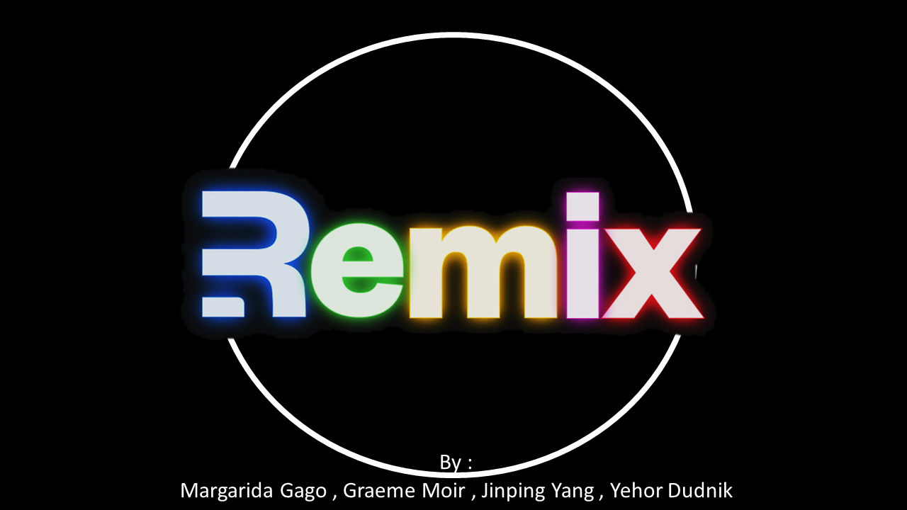

# Contents
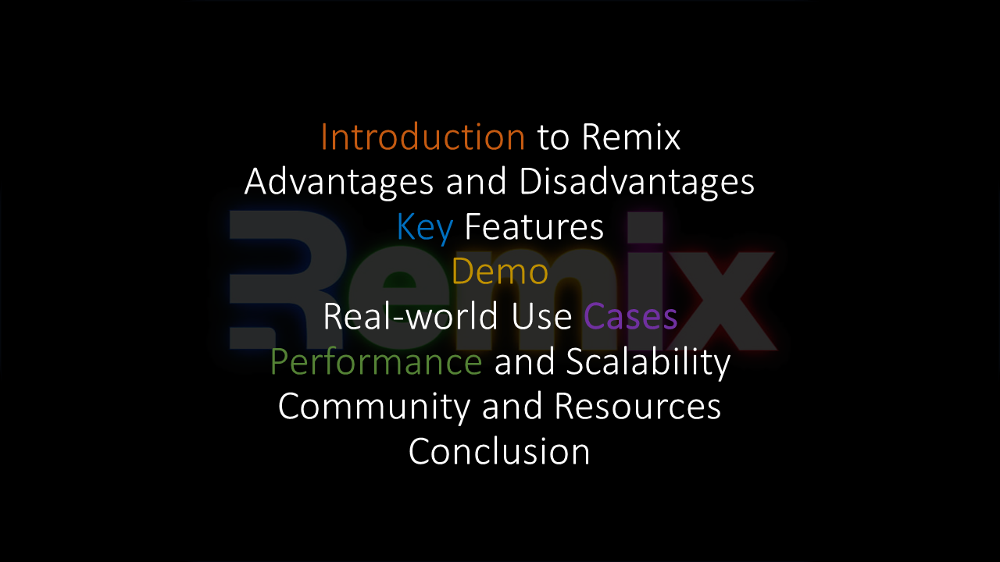

# Introduction to Remix
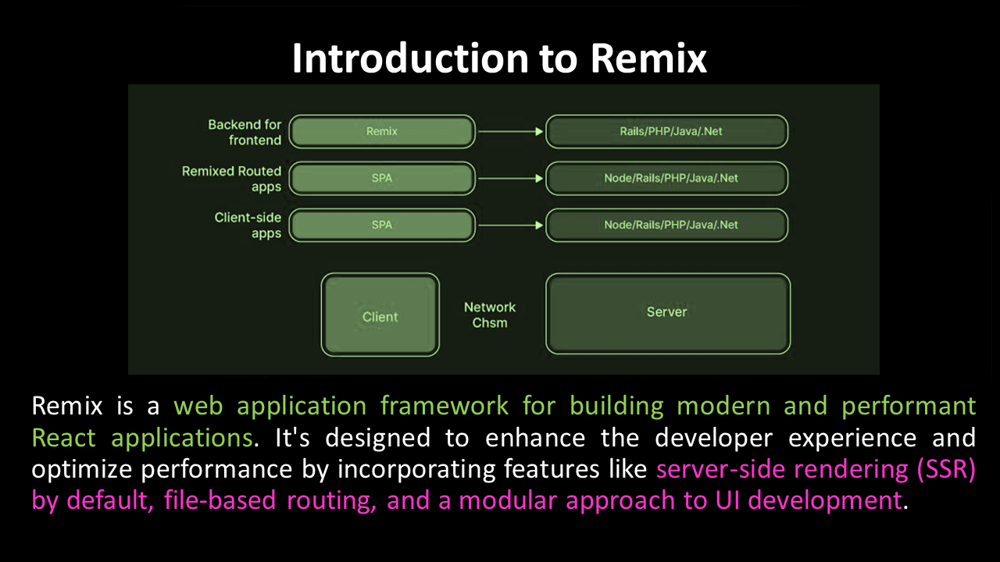

# Advantages and Disadvantages
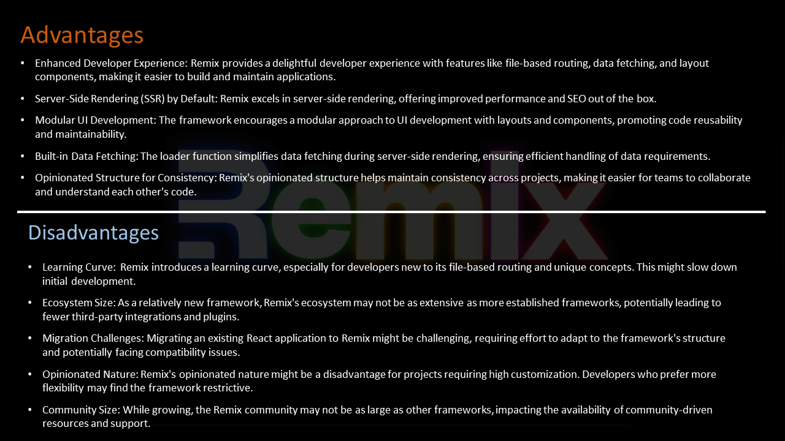

## Advantages
* Enhanced Developer Experience: Remix provides a delightful developer experience with features like file-based routing, data fetching, and layout components, making application development easier and more enjoyable.
* Server-Side Rendering (SSR) by Default: Remix excels in server-side rendering, offering improved performance and SEO benefits right out of the box.
* Modular UI Development: The framework encourages a modular approach to UI development with layouts and components, enhancing code reusability and maintainability.
* Built-in Data Fetching: The loader function simplifies data fetching during server-side rendering, ensuring efficient handling of data requirements.
* Opinionated Structure for Consistency: Remix's opinionated structure helps maintain consistency across projects, facilitating collaboration and code understanding within teams.

## Disadvantages

* Learning Curve: Remix has a learning curve, which can slow down developers, especially those new to its file-based routing and unique concepts.
* Ecosystem Size: Remix is relatively new, so its ecosystem might not have as many third-party integrations and plugins as more established frameworks.
* Migration Challenges: Adapting an existing React application to Remix can be challenging due to differences in structure and potential compatibility issues.
* Opinionated Nature: Remix's opinionated approach might restrict customization, making it less suitable for projects that require high flexibility.
* Community Size: While growing, Remix's community might not be as large as other frameworks, affecting the availability of community-driven resources and support.

# Key Features
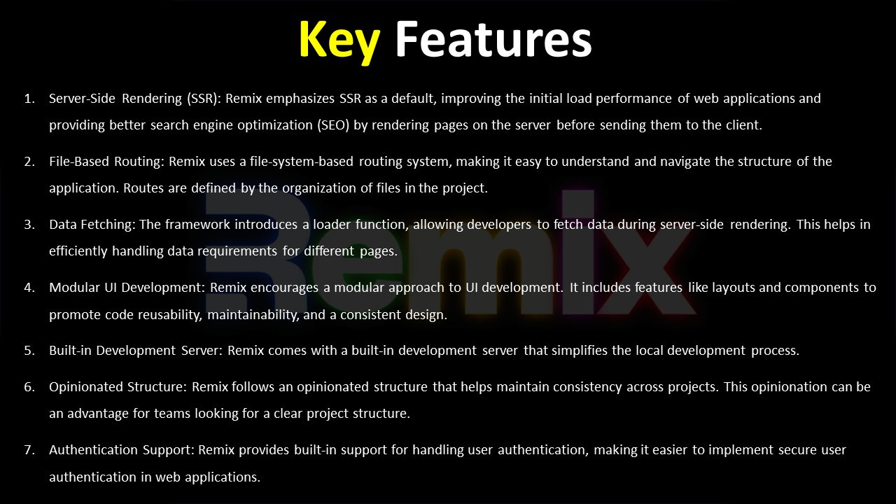


# Demo
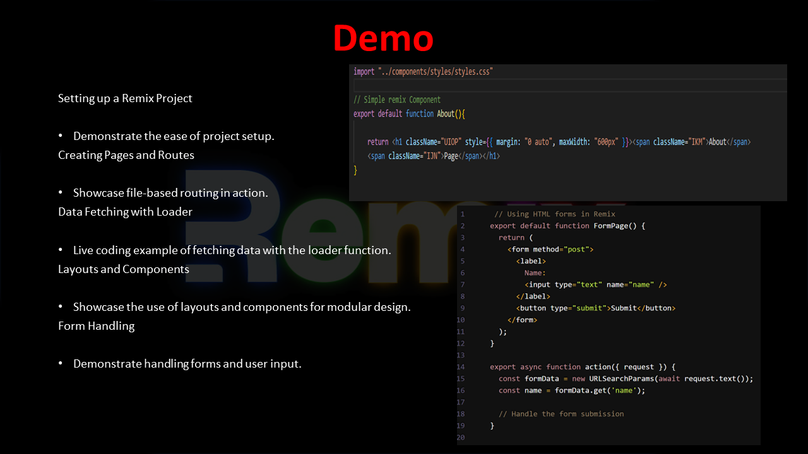


1. Demonstrate the ease of project setup.
Creating Pages and Routes
2. Showcase the use of layouts and components for modular design.
Form Handling

```
// A single Remix component

import "../components/styles/styles.css"

// Simple remix Component
export default function About(){

    return <h1 className="UIOP" style={{ margin: "0 auto", maxWidth: "600px" }}><span className="IKM">About</span> 
    <span className="IJN">Page</span></h1>
}

```


1. Demonstrate handling forms and user input.
2. Live coding example of fetching data with the loader function.
Layouts and Components

```
// Using HTML forms in Remix

import { Link } from 'remix';

export default function FormPage() {
    return (
        <form method="post">
        <label>
        Name:
        <input type="text" name="name"/>
        </label>
        <button type="submit">Submit</button>
        </form>
    );
}


export async function action({ request }) {
    const formData = new URLSearchParams(await request.text());
    const name = formData.get('name');
    // Handeling the form submission
}
```

# Demo slide 2
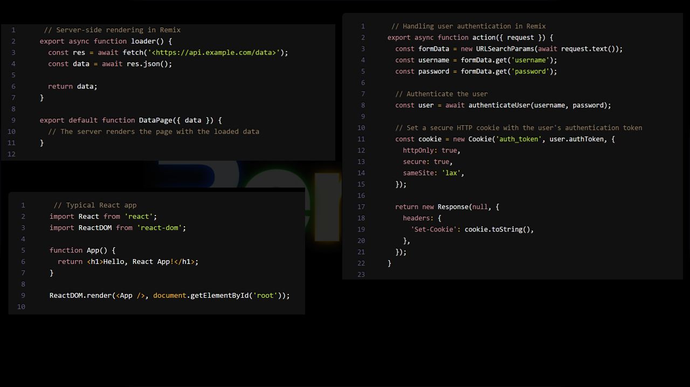

 * Server-side rendering
 * Handeling user authentication in Remix


 # Demo slide 3
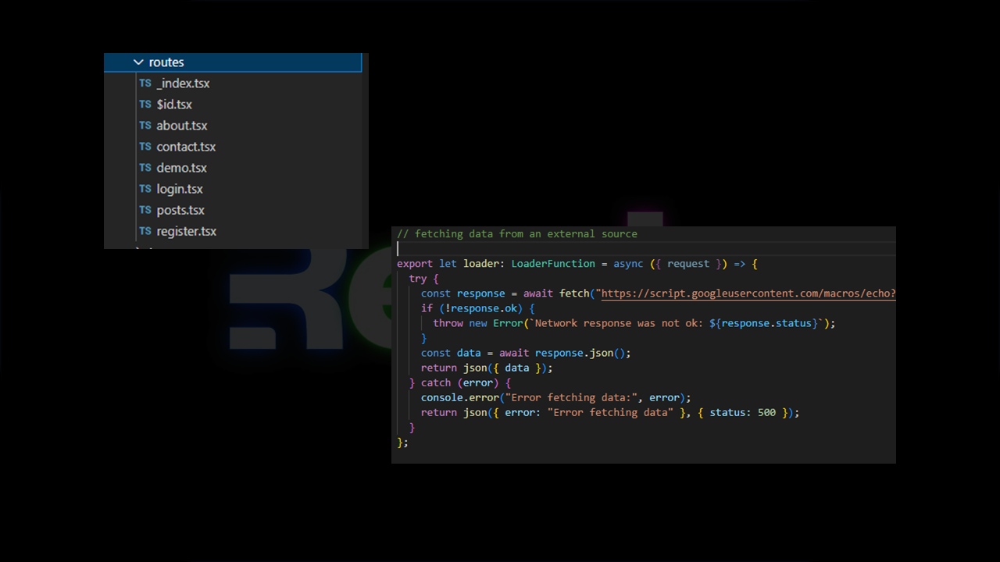
*  Routing
* Fetching data from an external source

# Demo slide 4
## Result

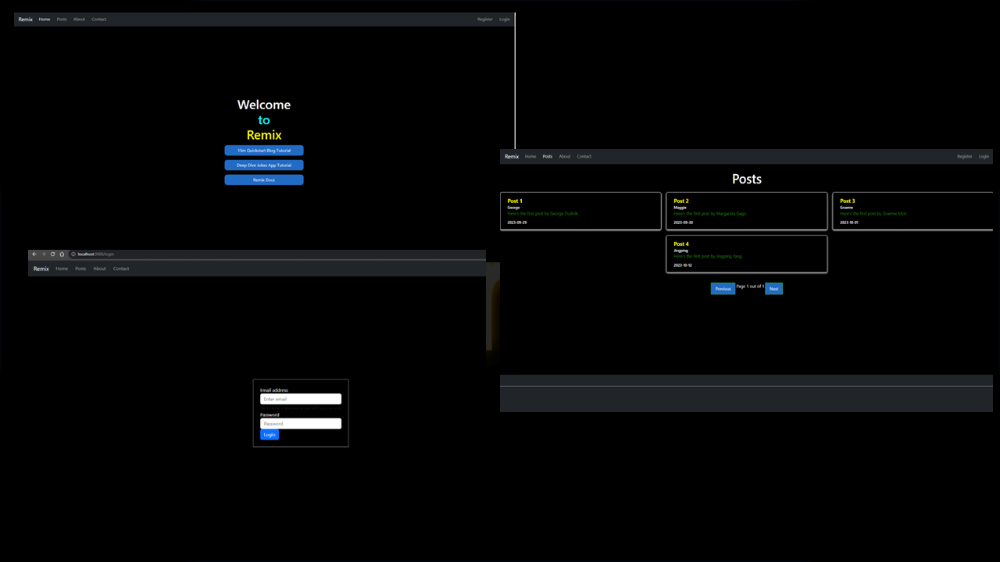


# Remix and React
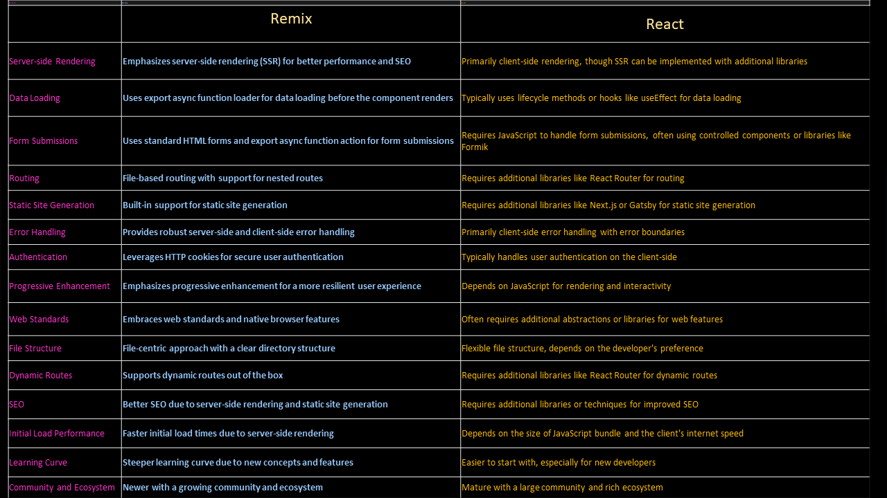

# Express.js and Next.js
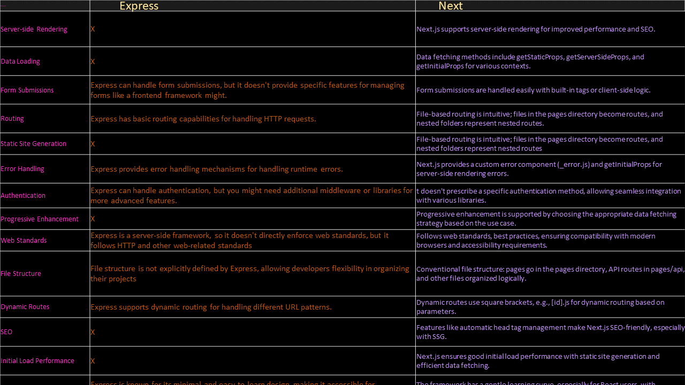

# Companies that use Remix


# Conclusion 

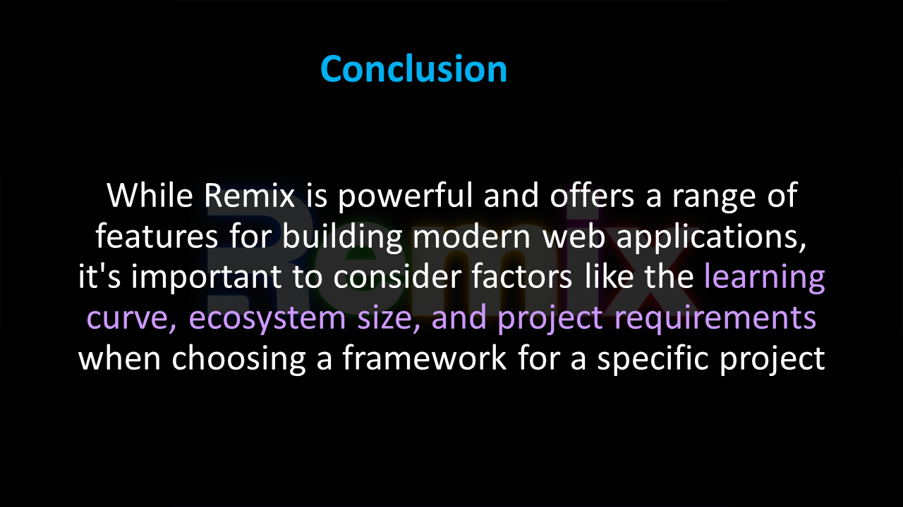
