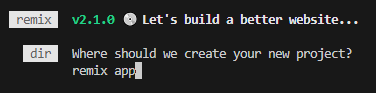

## Remix Tutorial

Remix is a framework that is built on React JS. It simplifies the process of building full stack React applications, where blending front end and back-end code is made seamless.

|Remix |Next.js|
|---|---|
|Always server-side rendered   | Optional server-side rendering supported   |   
|No static site generation (build time pre-rendering)   |Static site generation (at build time) supported   |  
|Always requires host that supports server-side code execution   |Deployment options: Static hosting vs server-side code execution   |

Before we start, we will need to ensure that we have the latest version of Node.js installed on your local machine.

Once installed, navigate to the folder where you would like to create the remix application and type in the below code and hit enter: 

It will take a little time to start creating the application but once done you will be prompted to name your new app. In this case I have simply named it ‘remix app’:

After hitting ‘enter’ again you will be prompted with two more questions about creating a new GitHub repository (if GitHub is installed on your IDE) and whether to install dependencies with npm. For both these options I selected ‘yes’  
NOTE: IDE =  integrated development environment, we select yes to init git repository so we can control our project versions down the road, also we install dependecies that are neccessary for our project.

In this example I received an update stating that there was a new version of npm available, so I followed the instructions to install this.

# Docker environment configuration

Otherwise, we could configurate a new development container. This is so the project can work on any type of Operating Systems.

After the docker container finishes its pulling process, we can install remix in the newly created workspace. 

Then we agree to proceed with installation and choose our project’s name.

In our case we’ve initialized a new git repository, but it’s not required. 
After that a crucial step is to install all dependencies with npm install. 

Below are the new folders installed by remix:

First looking at the ‘package.json’ file, this contains a list of all the dependencies that are installed into this project, there are both remix dependencies and react ones as we are still building a full stack react app. There are also various scripts which can be executed build for production or to start the development server:

The ‘node_modules’ folder contains all the dependencies for this project so nothing within it should be edited. You can also delete this folder and bring it back by typing ‘npm install’ into the terminal.
The ‘public’ folder will contain any static assets for your application such as images.
The app folder is where you as the developer will spend most of your time as this is where you will define the react components you want to use as well as your routes – the pages you want to support in this full stack application.

The ‘root.tsx’ file is the route component that is always rendered regardless of which route is loaded – this is the wrapper that will be defined for all your different pages:

The two ‘entry’ .tsx files contains the code that will be executed for every request that reached the server. You can edit this code if required, but not recommended unless you know what you are doing. We will keep them as they are for now.
So, in the routes folder we have the ‘_index.tsx’ file which contains all the content for our homepage. 
To start the server and see what the content of our homepage is we will need to run the script ‘npm run dev’ in the terminal:

By holding ‘ctrl’ and clicking the link to localhost we will be presented with the below webpage:

To stop the server, use ‘ctrl + c’ in the terminal. This will create a prompt asking if you want to terminate the session, type ‘y’ and hit ‘enter.
Let’s take a closer look at our routes file where our routes are defined.

# First Steps 

For the time being we have only one route _index.tsx

To create a new route, by pressing add new file, and attach a new file with the name we would like our route to be. 

Now it’s an empty file, so using basic functionality we will add an h1 tag saying “Hello from the about page.”

To see the changes, we go to our browser and type in the search bar localhost:3000/about

# References

1. Academind. (2023, October 1). Remix Crash Course 2023. Retrieved from Youtube: https://www.youtube.com/watch?v=RBYJTop1e-g&t=1216s

2. Remix. (2023, October 1). Remix Docs. Retrieved from Remix.run: https://remix.run/docs/en/mai

